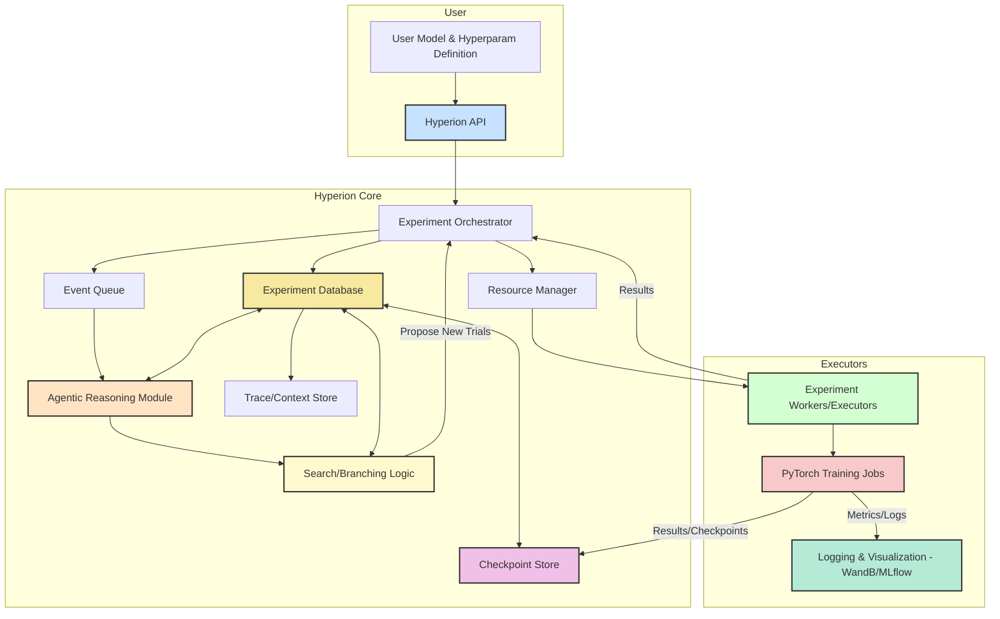
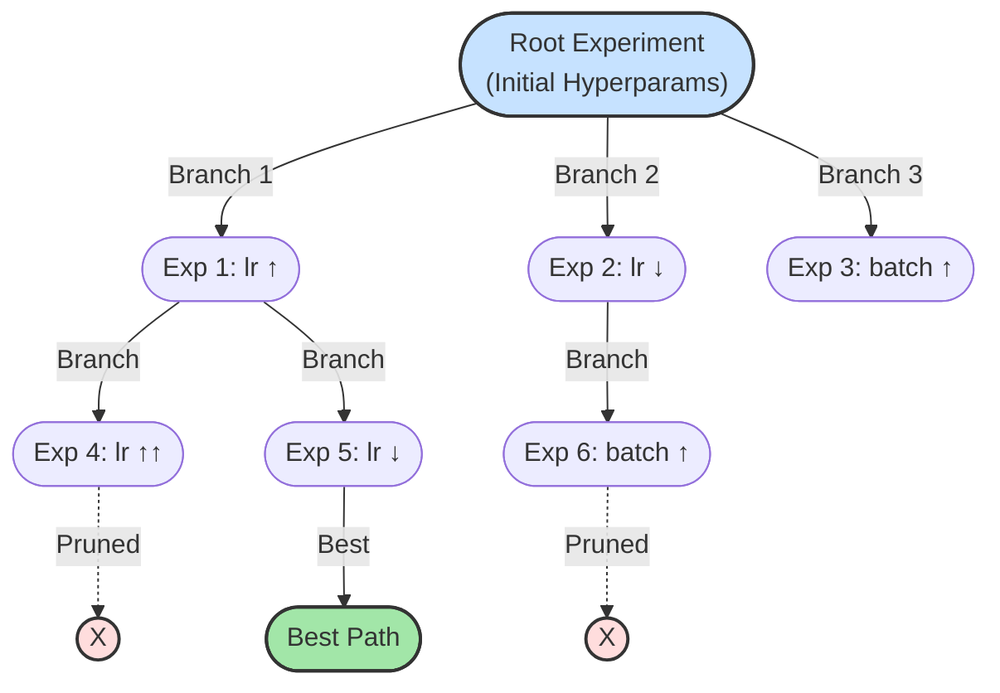
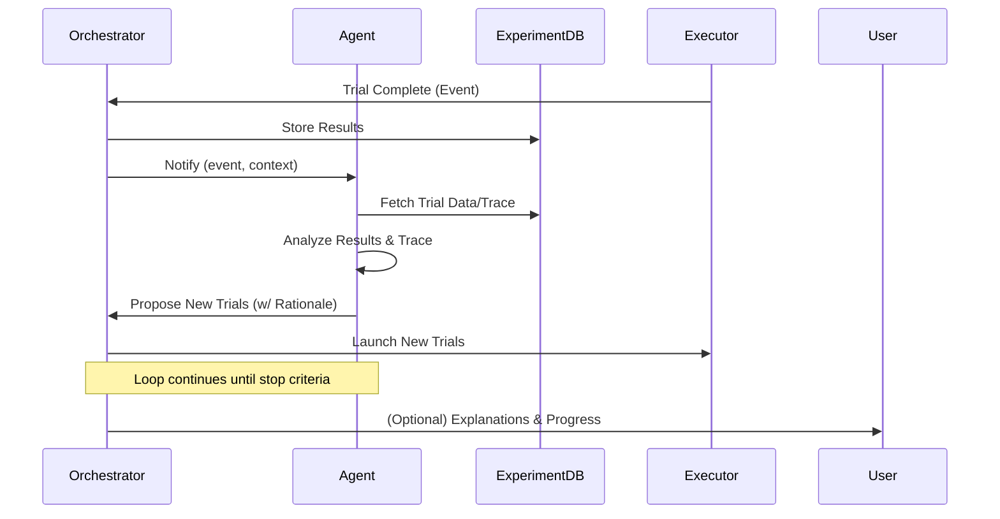
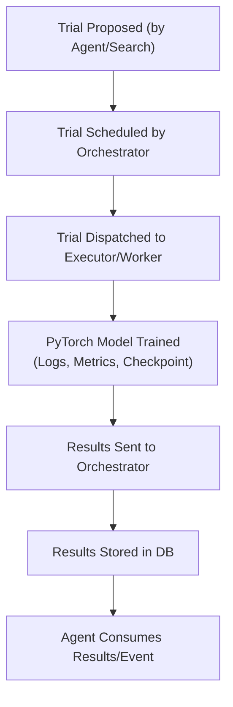
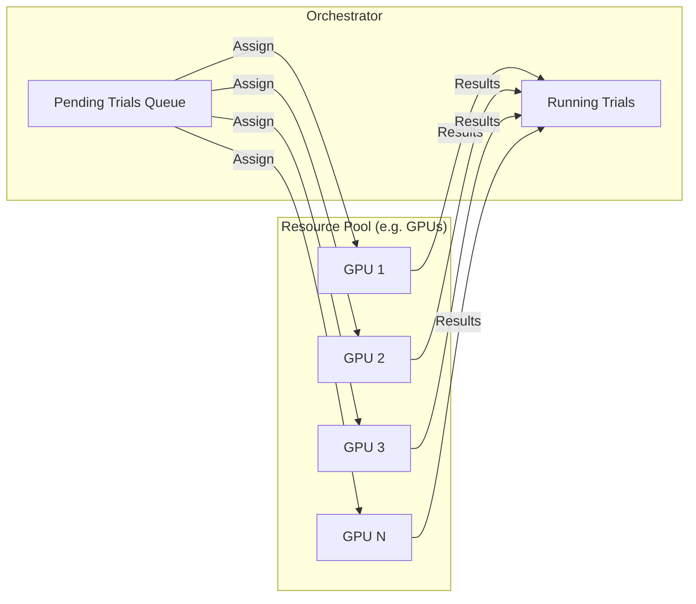
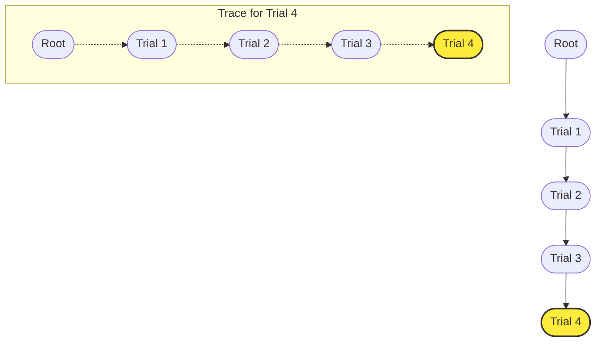
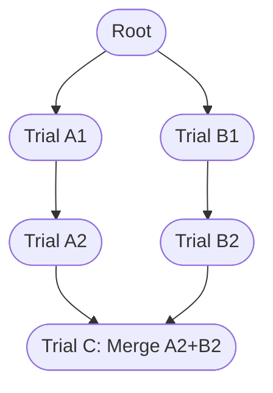

# hyperion

An agentic framework for hyperparameter tuning that runs parallel experiments using an exploration tree, while maintaining a transparent reasoning trace

## Overview

Hyperion is an open, agentic framework for hyperparameter optimization in the PyTorch ecosystem. Unlike traditional tuning libraries, Hyperion is built to orchestrate and reason about long-running, parallel model training experiments using an event-driven, agent-based approach. Experiments are represented as a dynamic graph, allowing the system to efficiently explore, branch, and prune hyperparameter configurations across multiple GPUs or nodes. Leveraging intelligent reasoning and traceable decision-making, Hyperion aims to automate the iterative process of finding optimal hyperparameters, reduce manual overhead, and provide interpretable insights for researchers and practitioners. The framework is highly modular and model-agnostic, supporting arbitrary architectures and training routines via a flexible interface.

## System Architecture

## Experiment Graph with Beam Search (Branching & Pruning)

## Event-drive Agent Reasoning Loop

## Experiment/Trial Lifecycle

## Parallel Resource Management

## Trace/Context Store Visualization

## Trace Graph with Merging

Beam search, PBT, and most HPO strategies produce many parallel branches/lineages. Good configurations may arise in separate "islands." It’s often suboptimal to pick just the best path and ignore others—sometimes combining the best of multiple lines yields a better result (e.g., learning rate from one, regularization from another). Hence, we should devise a solutions for achieving cross-branch context. Some approaches from the current literature involve:

- **Population Based Training (PBT)**: Routinely "steals" hyperparameters from better-performing members of the population, sometimes across very different branches. The population is constantly cross-pollinated .
- **Evolutionary HPO**: Crossover operators explicitly merge parts of two different parameter vectors (i.e., "children" inherit from two "parents").
- **AgentHPO and LLM-based agents**: Instruct the agent to consider the entire set of experiment traces/results when deciding next experiments—not just a single lineage .

